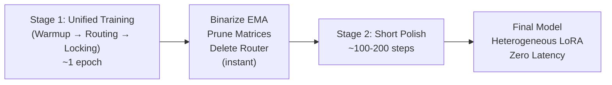

# RaaLoRA — Full Math Breakdown & Proposed 2-Stage Pipeline

---

## Part 1: The Math Behind the Paper

### 1.1 — What is LoRA? (The Foundation)

Imagine a pretrained model has a weight matrix `W₀` inside one of its layers. This matrix is huge (e.g., 2048 × 2048 = ~4 million numbers). Fine-tuning means updating all 4 million numbers — expensive.

**LoRA's trick:** Don't update `W₀` directly. Instead, learn a small *change* `ΔW` and add it on top:

```
W_new = W₀ + ΔW
```

But `ΔW` is also 2048 × 2048. That's still big. So LoRA says: **decompose `ΔW` into two skinny matrices:**

```
ΔW = B × A
```

Where:
- `A` is a small matrix of shape `(r × k)` — "compress the input"
- `B` is a small matrix of shape `(d × r)` — "expand back to output"
- `r` is the **rank** — a tiny number like 8 or 16

> **Why this works:** Most weight updates in neural networks are "low-rank" — meaning the useful information in the update can be captured by a much smaller matrix. It's like how a 1080p video can be compressed to a tiny file because most pixels are redundant.

**The forward pass becomes:**

```
y = W₀ · x + B · A · x
      ↑           ↑
  frozen       trainable (tiny)
```

**Parameter savings:**
- Full fine-tuning: `d × k` parameters (e.g., 2048 × 2048 = 4.2M)
- LoRA: `d × r + r × k` parameters (e.g., 2048 × 16 + 16 × 2048 = 65K)
- That's **~98% fewer parameters** to train!

---

### 1.2 — The Problem with Fixed Rank

Standard LoRA sets `r = 8` or `r = 16` for **every single layer**. But think about it:

- **Layer 3** might handle simple syntax (subject-verb agreement). It barely needs any adaptation. `r = 2` would be enough.
- **Layer 14** might handle complex reasoning and context. It needs deep modification. `r = 16` is necessary.

Using `r = 16` everywhere means **Layer 3 wastes 14 rank dimensions** doing nothing useful. That's wasted VRAM and wasted compute.

> **Analogy:** It's like giving every employee in a company the same salary — the CEO and the intern. Some roles need more budget, some need less.

---

### 1.3 — Stage 1: Baseline LoRA Training

**What happens:** We initialize every layer's LoRA with the maximum rank `R_max` (e.g., 16). We train normally for 1 epoch with standard language modeling loss.

**The math (standard cross-entropy loss):**

```
L_task = -Σ log P(correct_token | previous_tokens)
```

This is just "how wrong is the model's prediction?" We minimize this.

**Why this stage exists:** Before we can figure out which layers need high vs. low rank, we need the LoRA weights to have *some* meaningful values first. If we start routing from random weights, the router has nothing useful to measure.

**Config from paper:**
- Learning rate: `2e-4`
- Epochs: `1`
- Batch size: `8`
- R_max: `16`, alpha: `32`

---

### 1.4 — Stage 2: The Router (The Core Innovation)

This is where RaaLoRA actually does its magic. We add a small neural network called the **Router** that watches the input and decides, *for each layer*, how much rank capacity it actually needs.

#### Step 1: Average Pooling — Summarize the Input

The input to a transformer is a sequence of token embeddings:

```
X = [x₁, x₂, x₃, ..., xₜ]     (shape: T × d)
```

where `T` = number of tokens, `d` = embedding dimension.

We need ONE fixed-size vector to describe "what kind of input is this?" So we average all tokens:

```
c = (1/T) × Σ xₜ               (shape: 1 × d)
```

> **Why average pooling?** It's dead simple, cheap to compute, and gives a reasonable summary of "what topics/features are present in this input." It doesn't matter if the input has 50 or 500 tokens — `c` is always the same size.

#### Step 2: Router MLP — Map Context to Layer Ranks

The router is a small MLP (Multi-Layer Perceptron) with a bottleneck:

```
c  →  [Linear(d, 256)]  →  [ReLU]  →  [Linear(256, L × R_max)]  →  [Sigmoid]  →  R
         ↑                                    ↑                          ↑
   compress to 256-dim              expand to (layers × ranks)    squash to 0-1
```

The output `R` is reshaped into a matrix of shape `(L × R_max)`:

```
R = ┌─────────────────────────────────┐
    │ Layer 1:  [0.9, 0.8, 0.7, ..., 0.1] │  ← "Layer 1 needs ~3 high ranks"
    │ Layer 2:  [0.9, 0.9, 0.9, ..., 0.8] │  ← "Layer 2 needs ALL ranks"
    │ Layer 3:  [0.2, 0.1, 0.1, ..., 0.0] │  ← "Layer 3 needs almost nothing"
    │ ...                                   │
    │ Layer L:  [0.8, 0.7, 0.3, ..., 0.1] │
    └─────────────────────────────────┘
```

Each value is between 0 and 1 (thanks to Sigmoid). Think of it as a **"probability that this rank dimension matters for this layer, given this specific input."**

#### Step 3: Apply Routing as Diagonal Scaling

For layer `i`, we take row `i` of the routing matrix and use it to **scale** the LoRA output:

```
Standard LoRA:    y_i = W₀ · x + B_i · A_i · x

With routing:     y_i = W₀ · x + B_i · diag(R[i]) · A_i · x
                                        ↑
                              scales each rank dimension
                              by its importance (0 to 1)
```

> **What `diag(R[i])` means:** If `R[i] = [0.9, 0.8, 0.1]`, then rank dimension 1 gets multiplied by 0.9 (kept), rank dimension 2 by 0.8 (kept), rank dimension 3 by 0.1 (essentially killed). The router is **soft-pruning** in real-time.

#### Step 4: Budget Penalty — Force Efficiency

Without any constraint, the router would just output all 1s ("keep everything!") because that minimizes the task loss. We need to push it to be economical.

**The budget penalty:**

```
L_budget = λ × max(0, mean(R) - τ)²
```

Breaking this down:
- `mean(R)` = average of ALL values in the routing matrix (across all layers, all rank dimensions, all samples in the batch). This is "how much total capacity is the router using?"
- `τ` (tau) = the **target budget**. e.g., if `R_max = 16` and `τ = 0.5`, we're saying "on average, only use half of the available rank dimensions"
- `max(0, ...)` = **one-sided penalty**. If the router uses LESS than the budget, no penalty at all! We only punish going OVER budget.
- `λ` = how aggressively we penalize. Higher λ = sparser model.

**Total training loss:**

```
L_total = L_task + L_budget
```

> **How this trains:** Through backpropagation, the router learns: "If I reduce Layer 3's mask to near-zero, the task loss barely changes, but the budget penalty drops significantly. Good trade!" Meanwhile, "If I reduce Layer 14's mask, the task loss spikes. Bad trade — keep it high."

**Dual learning rate strategy:**
- LoRA weights (`A`, `B`): `1e-4` (slow, careful updates)
- Router weights: `1e-3` (fast, aggressive learning — the router needs to converge quickly)

---

### 1.5 — Stage 3: Calibration & Pruning

Training is done. The router knows which layers need which ranks. But the router is still a neural network that runs on every input — we don't want that overhead during inference.

#### Step 1: Freeze & Calibrate

Freeze the router. Pass the entire dataset through the model and **collect** every routing matrix `R` that the router produces:

```
M = (1/N) × Σ R_n       (average over N samples)
```

`M` is the **global average routing matrix** — "across ALL inputs, on average, how important is each rank dimension for each layer?"

#### Step 2: Binarize

Pick a threshold `τ_prune`:

```
M_binary[i,j] = 1    if M[i,j] >= τ_prune
M_binary[i,j] = 0    if M[i,j] < τ_prune
```

#### Step 3: Extract Final Ranks

For each layer `i`:

```
r_i = sum(M_binary[i, :])     (count of 1s in that row)
```

Example:
```
Layer 1: [1, 1, 1, 0, 0, ..., 0]  → r₁ = 3
Layer 2: [1, 1, 1, 1, 1, ..., 1]  → r₂ = 16
Layer 3: [1, 0, 0, 0, 0, ..., 0]  → r₃ = 1
```

#### Step 4: Physically Prune the Matrices

For layer `i` with new rank `r_i`:
- Keep only the first `r_i` columns of `B_i`  (shape: `d × r_i`)
- Keep only the first `r_i` rows of `A_i`     (shape: `r_i × k`)
- **Delete the router entirely**

The model now has **heterogeneous ranks** — each layer has exactly the rank it needs. No router at inference time. Zero added latency.

---

### 1.6 — Stage 4: Polish Run

The hard pruning in Stage 3 is a shock to the network. Weights that were trained with soft masks (e.g., 0.4) suddenly see their rank dimension completely gone. The model needs a short retraining to adjust.

- Learning rate: `1e-4` (very gentle)
- Epochs: `1`
- No router, no budget penalty — just standard LoRA fine-tuning with the new heterogeneous ranks

---

### 1.7 — Is the Math Feasible?

**Yes, completely.** Here's why each component is grounded:

| Component | Mathematical Basis | Proven In |
|-----------|-------------------|-----------|
| Low-rank decomposition (ΔW = BA) | Matrix factorization / SVD theory | LoRA (Hu et al., 2021) |
| Average pooling for context | Simple mean estimator | Used everywhere in NLP |
| MLP router with sigmoid | Standard neural network function approximation | MoE literature (Shazeer et al., 2017) |
| Budget penalty (L1/L2 on activations) | Regularization theory | Pruning literature (Molchanov et al., 2019) |
| Binarization via thresholding | Hard quantization | Lottery Ticket Hypothesis (Frankle & Carlin, 2018) |

There's nothing exotic here. Every piece is well-understood and battle-tested individually. The novelty is in **how they're composed together**: use dynamic routing to *discover* ranks, then throw away the router.

---

---

## Part 2: The Proposed 2-Stage Pipeline

### 2.1 — Why 4 Stages is Wasteful

Let's count the actual GPU-hours in the original pipeline:

```
Stage 1:  Train for 1 epoch            →  ~1 hour
Stage 2:  Train for 1 epoch (+ router) →  ~1.2 hours
Stage 3:  Calibration pass             →  ~0.3 hours
Stage 4:  Polish for 1 epoch           →  ~0.8 hours
                                       ─────────────
                                Total: ~3.3 hours
```

We're training the model **twice** (Stage 1-2, then Stage 4), and doing a throwaway calibration pass (Stage 3). On a single T4 GPU, this adds up.

Also, every time you stop and restart training, you lose optimizer momentum (Adam's running averages get reset), which hurts convergence.

---

### 2.2 — The 2-Stage Pipeline

#### Stage 1: Unified Training (One Continuous Run)

We merge old Stages 1, 2, and 3 into a single training loop with **scheduled behavior changes**:

```
Step 0                    Step S₁                    Step S₂              Step S_end
│                         │                          │                    │
│   WARMUP PHASE          │    ROUTING PHASE         │  LOCKING PHASE     │
│   λ = 0                 │    λ ramps up linearly   │  λ = λ_max         │
│   Router exists but     │    Router actively       │  EMA is nearly     │
│   its penalty is off    │    learning ranks        │  converged         │
│   LoRA learns basics    │    Budget pressure on    │  Ranks are stable  │
│                         │                          │                    │
└─────────────────────────┴──────────────────────────┴────────────────────┘
                    ONE continuous training loop
```

**What's happening at each phase:**

**Warmup (0 → S₁):**
- The router exists and runs (its outputs scale the LoRA), but `λ = 0` so there's no budget pressure
- LoRA weights learn meaningful features from scratch
- The router just observes — it doesn't try to prune anything yet
- This replaces Stage 1

**Routing (S₁ → S₂):**
- `λ` linearly increases from 0 to `λ_max`
- The router starts feeling pressure to be efficient
- It gradually learns which layers can have low rank without hurting the task loss
- Because the pressure is gradual, there's no sudden shock — the LoRA weights adapt alongside the router
- This replaces Stage 2

**Locking (S₂ → S_end):**
- `λ` is at its maximum; the router has converged on its rank decisions
- We track an **Exponential Moving Average (EMA)** of the routing matrix:

```python
# Every step in the locking phase:
ema_M = β × ema_M + (1 - β) × current_R    # β = 0.99
```

- By the end of training, `ema_M` IS the global average routing matrix — no separate calibration pass needed!
- This replaces Stage 3

**Post-training (instant, no GPU needed):**
```python
# Binarize the EMA
binary_M = (ema_M >= threshold).int()

# Extract ranks
ranks = binary_M.sum(dim=1)   # [r₁, r₂, ..., r_L]

# Prune A and B matrices, delete router, save model
```

#### Stage 2: Short Polish (~100-200 steps)

- Load the pruned model
- Fine-tune with a very low learning rate (`1e-5`)
- Run for only **100-200 steps**, NOT a full epoch
- This recovers the small quality gap from hard pruning

**Why we still need this short polish:**
During training, the router outputs soft values like `0.4` or `0.7`. The LoRA weights learn to work with these scaled outputs. When we hard-prune (snap to 0 or 1), there's a small mismatch. 100-200 steps is enough to fix this — the network just needs to slightly readjust its remaining weights.

---

### 2.3 — Why This is Better

| Aspect | 4-Stage Pipeline | 2-Stage Pipeline |
|--------|-----------------|-----------------|
| **Total training steps** | ~2.5 epochs worth | ~1.1 epochs worth |
| **Optimizer resets** | 3 times (lose momentum) | 1 time |
| **Separate calibration pass** | Yes (wasted compute) | No (EMA does it for free) |
| **Polish cost** | Full 1 epoch | ~100-200 steps (~5% of an epoch) |
| **Hyperparameters to tune** | Separate LR/epochs per stage | One LR schedule + λ ramp |
| **Code complexity** | 4 separate scripts | 1 training script + 1 short polish |
| **Risk of human error** | High (must transfer weights correctly between stages) | Low (one continuous run) |

**Estimated GPU-hour savings:**

```
2-Stage:  Unified training (~1.3 hours) + Short polish (~0.05 hours) = ~1.35 hours
4-Stage:  ~3.3 hours

Savings: ~60%
```

---

### 2.4 — Why This is Realistic

Every component is proven:

1. **Scheduled regularization warmup** — Used in literally every modern training pipeline (weight decay warmup, dropout scheduling, etc.)

2. **EMA tracking** — PyTorch has built-in EMA. It's one multiply-add per step. Zero overhead.

3. **Short polish after pruning** — This is standard practice in the pruning literature. The lottery ticket hypothesis papers all do this.

4. **Gradual penalty ramp** — More stable than sudden penalty activation. The network adapts smoothly.

> [!IMPORTANT]
> The key insight is: **we're not inventing new math**. We're just reorganizing the same operations into a smarter schedule that avoids redundant work.

---

### 2.5 — The Penalty Schedule in Detail

```
λ(step) = 
    0                                          if step < S₁
    λ_max × (step - S₁) / (S₂ - S₁)          if S₁ ≤ step < S₂
    λ_max                                      if step ≥ S₂
```

Visually:

```
λ
│
λ_max ──────────────────────────────────────────────────── ●
│                                                  ╱
│                                            ╱
│                                      ╱
│                                ╱
│                          ╱
│                    ╱
0 ●────────────────●
  │                │                                      │
  0               S₁                                    S_end
       WARMUP              ROUTING + LOCKING
```

---

### 2.6 — Summary



The 2-stage pipeline delivers the same result as the 4-stage pipeline — a heterogeneous-rank LoRA model with no router at inference — but does it in **60% less time**, with **fewer failure points**, and **cleaner code**.
